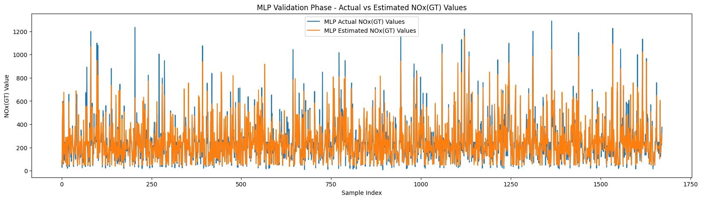
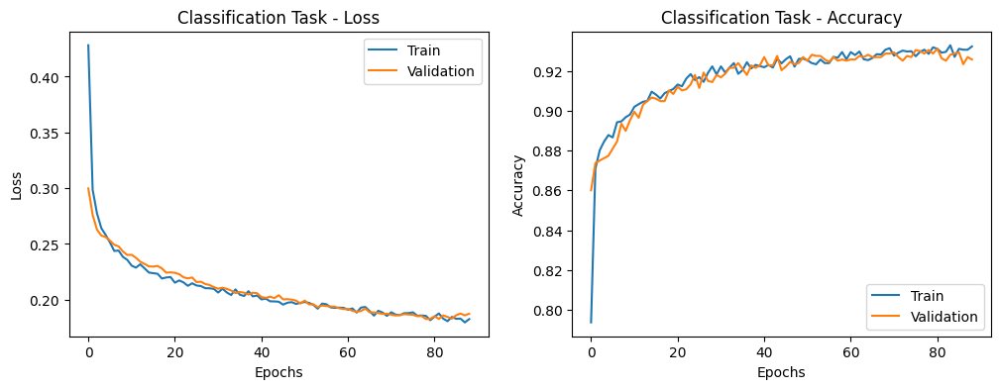
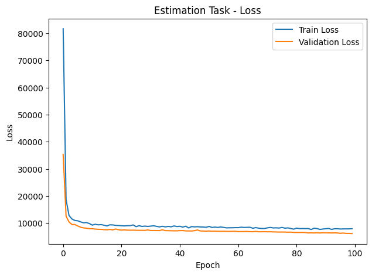

# Air Quality Analysis with Neural Networks

This project involves analyzing air quality data using neural networks to perform two distinct tasks: **binary classification** and **regression**. The data is preprocessed to handle missing values, and the models are designed to make predictions based on historical air quality features.

---

## Project Overview

### 1. **Classification Task**
The objective of this task is to predict whether the concentration of **Carbon Monoxide (CO)** exceeds a certain threshold—the mean value of CO concentration (`CO(GT)`) in the dataset. This is a **binary classification problem** where the neural network classifies data instances as:
- **Above the threshold**: Concentration exceeds the mean.
- **Below the threshold**: Concentration is less than or equal to the mean.

**Key Features:**
- Missing values (represented as `-200`) are handled by replacing them with the column mean.
- A threshold is calculated using the mean of `CO(GT)` values.
- A custom-designed neural network with dropout layers is used to prevent overfitting.

---

### 2. **Regression Task**
The goal of the regression task is to predict the concentration of **Nitrogen Oxides (NOx)** using other air quality features. This is a **continuous prediction problem** where the network estimates a numerical value for NOx concentration.

**Key Features:**
- Missing values in features are handled by replacing them with column-wise means.
- A custom neural network is designed for regression to predict NOx concentration based on other features.

---

## Implementation Details

### Data Preprocessing
- Missing values (`-200`) are replaced with the mean of the respective feature columns.
- Features are standardized using **StandardScaler** to improve model convergence.

### Classification Model
- **Architecture**:
  - Input layer with 11 features.
  - Three hidden layers with the following configurations:
    - 1st hidden layer: 36 neurons, ReLU activation, 30% dropout.
    - 2nd hidden layer: 28 neurons, ELU activation, 30% dropout.
    - 3rd hidden layer: 6 neurons, ELU activation.
  - Output layer with 1 neuron and sigmoid activation for binary classification.
- **Training**:
  - Loss function: Binary Crossentropy.
  - Optimizer: Adam with a learning rate of 0.001.
  - Metrics: Binary Accuracy, Precision.
  - Early stopping is applied to prevent overfitting.

### Regression Model
- **Architecture**:
  - Input layer with 10 features.
  - Three hidden layers with the following configurations:
    - 1st hidden layer: 36 neurons, ReLU activation, 20% dropout.
    - 2nd hidden layer: 28 neurons, ReLU activation, 20% dropout.
    - 3rd hidden layer: 6 neurons, ReLU activation.
  - Output layer with 1 neuron for continuous prediction.
- **Training**:
  - Loss function: Mean Squared Error.
  - Optimizer: Adam.
  - Metrics: Mean Squared Error (MSE), Root Mean Squared Error (RMSE).

---

## Results and Evaluation

### Classification Task
| Confusion Matrix     |   Positive (Actual) |   Negative (Actual) |
|:---------------------|--------------------:|--------------------:|
| Positive (Predicted) |                1051 |                  41 |
| Negative(predicted)  |                  75 |                 505 |

|                       |   Accuracy |   Precision |   Number of Samples |
|:----------------------|-----------:|------------:|--------------------:|
| CO(GT) classification |   0.930622 |    0.924908 |                1672 |


### Regression Task
|    RMSE |     MAE |   Number of Samples |
|--------:|--------:|--------------------:|
| 78.0184 | 49.1878 |                1672 |


- **Actual vs Predicted NOx Values**:


---

## Visualizations

### Classification Task
- **Training and Validation Acuuracy and Loss:**


### Regression Task
- **Training and Validation Loss:**
  


---

## How to Run the Code

1. Install the required libraries:
 ```bash
 pip install pandas numpy matplotlib scikit-learn tensorflow tabulate

